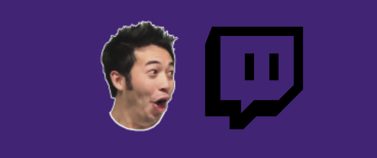

# Introduction
Ghost chat is a standalone Twitch chat application written in Electron and Vue.
It lets you connect to a channel without the need of opening twitch in your browser which comes in handy if you happen to have only one monitor,
or you just want to have your chat on your main screen.

#How it works

