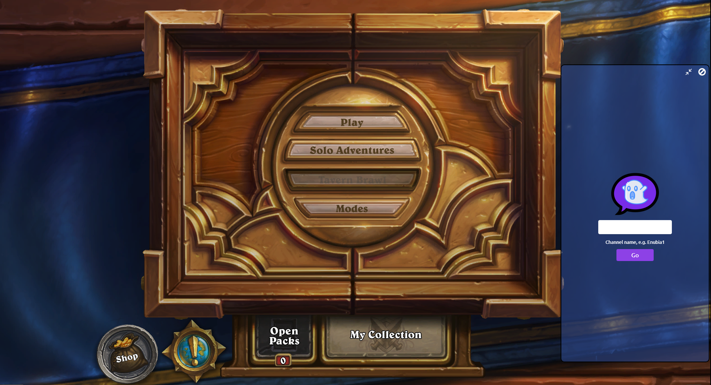
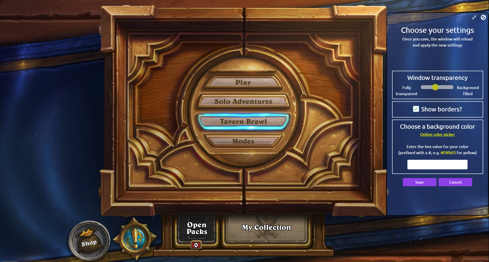
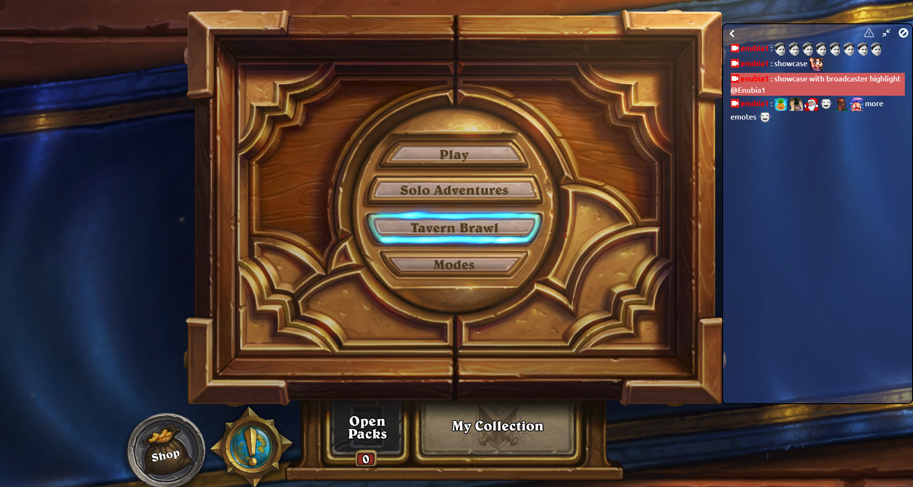
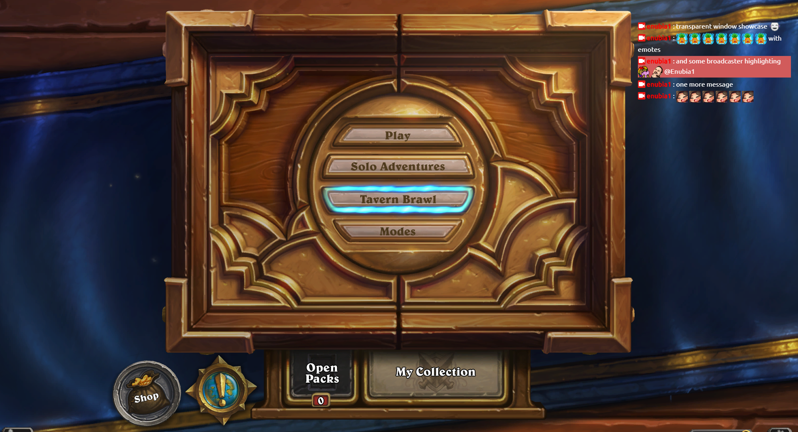

  <!--  -->
  
  
  
  <!--  -->
  

### V2 is in development and the roadmap can be tracked here [#426](https://github.com/Enubia/ghost-chat/issues/426)

### For (feature) suggestions I'd recommend joining the [Discord](https://discord.gg/UVMX32dDcy) and post it in the appropriate channel or create a new [issue](https://github.com/Enubia/ghost-chat/issues/new/choose)

---

# Ghost Chat

Ghost chat is a standalone [Twitch.tv](https://www.twitch.tv) chat as overlay on windowed/windowed full screen applications written in Electron and Vue.

It lets you connect to a channel without the need of opening twitch in your browser which comes in handy if you happen to have only one monitor,
or you just want to have your chat on your main screen.

## Installation / Usage

- Download the latest release (installer or standalone) from [https://github.com/Enubia/ghost-chat/releases](https://github.com/Enubia/ghost-chat/releases).
- The first time you launch it on Windows, `Windows protected your PC` will appear. This is due to the fact that Windows Defender Smart Screen can't find the code signing certificate. Just click `More info` and then `Run anyway`. You'll only have to do this once.
- After launching the application, enter the channel you want to receive chat messages from and click go / press enter.
- You can move the window around by clicking and dragging the top section where minimize and close buttons are.
- If you want to resize it, just click and drag the borders to whatever size you want.

- Settings can be reached through the context menu.

- Chat window

- With a click on the ghost, you'll set the window to transparent, remove the borders and make it click through. This can be reverted by clicking `Revert Click through` in the tray icon menu.

- result

## Additional info

If you have any suggestions for features, or you've found a bug, feel free to go to [https://github.com/Enubia/ghost-chat/issues/new/choose](https://github.com/Enubia/ghost-chat/issues/new/choose). You can also contact me via [Discord](https://discord.gg/UVMX32dDcy).

# Contributing

Please refer to our [contributing guidlines](CONTRIBUTING.md).
