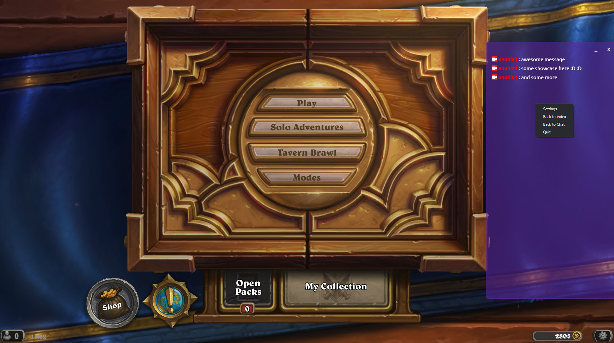
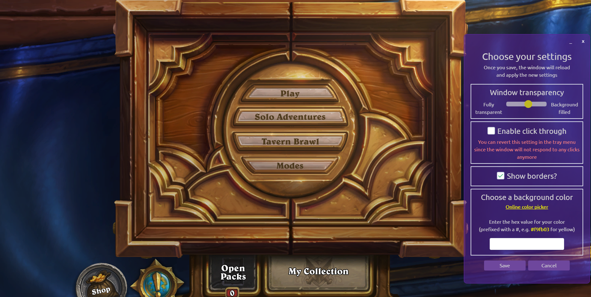

# Ghost Chat

Ghost chat is a crossplatform, standalone [Twitch.tv](https://www.twitch.tv) chat as overlay on windowed/windowed fullscreen applications written in Electron and Vue.

It lets you connect to a channel without the need of opening twitch in your browser which comes in handy if you happen to have only one monitor,
or you just want to have your chat on your main screen.

(Currently Mac and Windows are supported, if there's demand I will publish a Linux version as well)

## Installation / Usage

- Download the latest release (installer or standalone) from [https://github.com/LettuceKiing/ghost-chat/releases](https://github.com/LettuceKiing/ghost-chat/releases).
- The first time you launch it on Windows, ```Windows protected your PC``` will appear. This is due to the fact that Windows Defender Smart Screen can't find the code signing certificate. Just click ```More info``` and then ```Run anyway```. You'll only have to do this once.
- After launching the application, enter the channel you want to receive chat messages from and click go / press enter.
- You can move the window around by clicking and dragging the top section where minimize and close buttons are.
- If you want to resize it, just click and drag the borders to whatever size you want.

- Settings can be reached through the context menu.



- You can adjust transparency, click through, hide/show borders, and the overall background color.



## Additional info

If you have any suggestions for features or you've found a bug, feel free to go to [https://github.com/LettuceKiing/ghost-chat/issues/new/choose](https://github.com/LettuceKiing/ghost-chat/issues/new/choose) and choose either Feature request or Bug report.

# Development setup

Clone/Download this repo

Install all dependencies inside the root directory

```bash
npm install
```

To start the development server with hot reload enabled

```bash
npm run electron:serve
```

if you want to build it for production run

```bash
npm run electron:build
```

Electron will build it for your current OS which you are running this script from.
