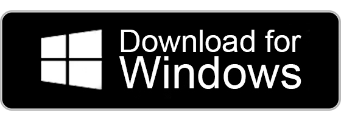
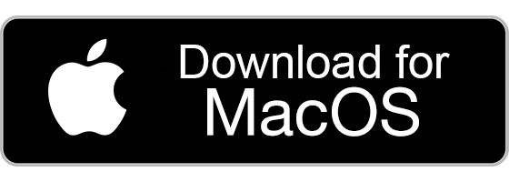
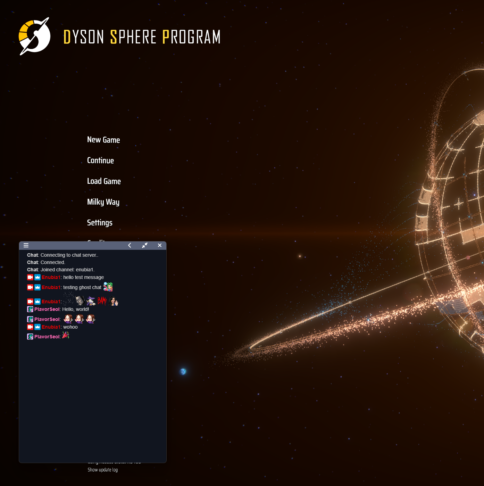
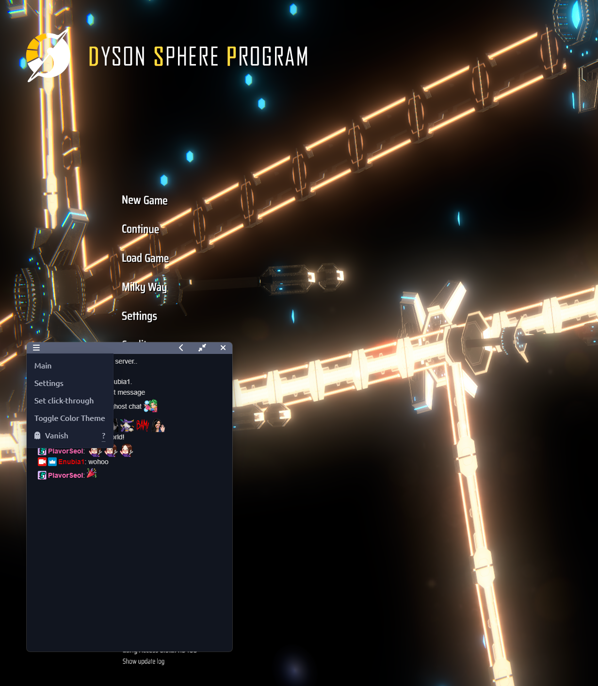
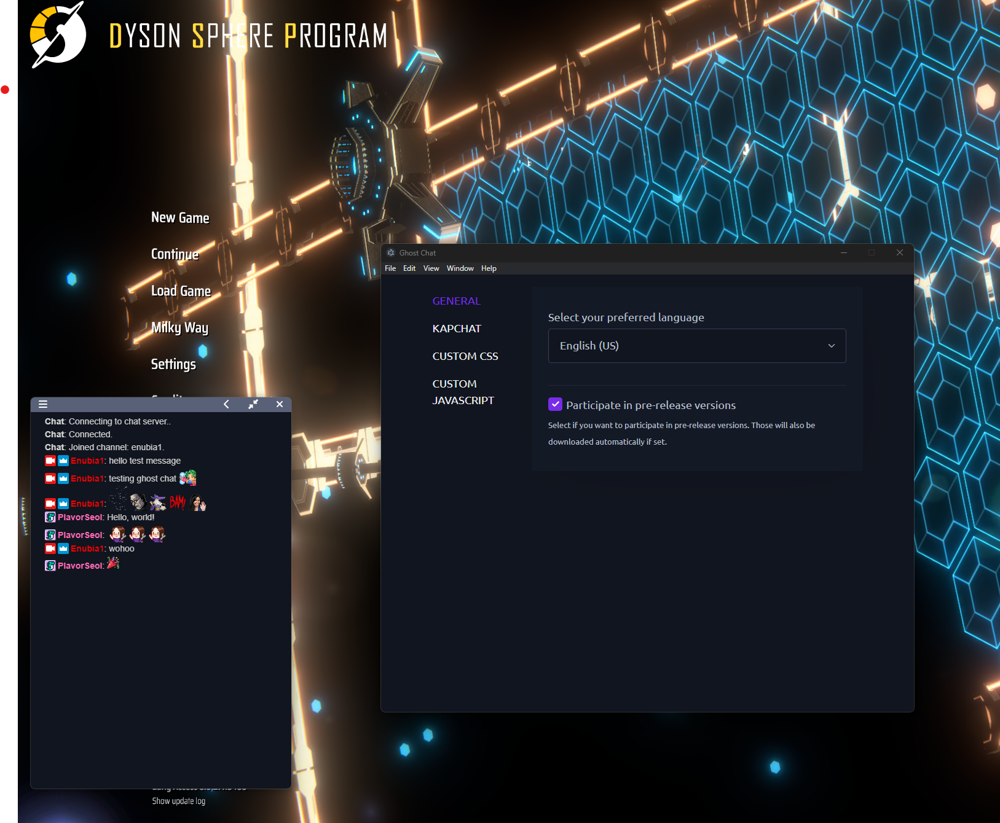
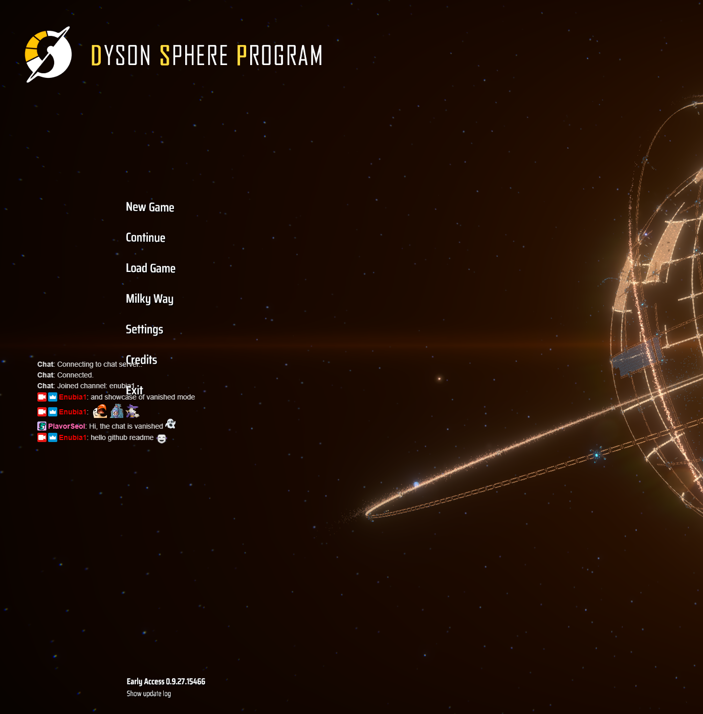
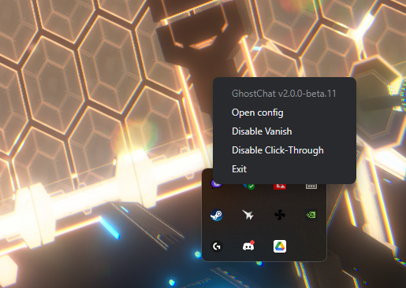

  <!--  -->
  
  
  <!--  -->
  <!--  -->
  

  
  

  
  

---

# Ghost Chat

Ghost chat is a standalone, multi-platform [Twitch.tv](https://www.twitch.tv) chat as overlay on windowed/windowed full screen applications written in Typescript with the help of Electron and Vue.

It lets you connect to a channel without the need of opening twitch in your browser which comes in handy if you happen to have only one monitor,
or you just want to have your chat on your main screen.

## Installation / Usage

- Download the latest release (mac or windows) from [the release page](https://github.com/Enubia/ghost-chat/releases).
- The first time you launch it on Windows, `Windows protected your PC` will appear. This is due to the fact that Windows Defender Smart Screen can't find the code signing certificate. Just click `More info` and then `Run anyway`. You'll only have to do this once.
- After launching the application, enter the channel you want to receive chat messages from and click go / press enter.
- You can move the window around by clicking and dragging the menu bar.
- If you want to resize it, just click and drag the borders to whatever size you want.
- GhostChat will remember the position and size of the window and will spawn in the same exact location again once you launch it the next time. 

  

- The menu bar holds a dropdown for you which can be used to access the settings, navigate back and forth between chat and launch page as well as interaction with the window.
- The settings page has a lot of configurations that you can apply, so if you don't know exactly what to click/insert I'd suggest to leave the defaults and ask for help in the [Discord](https://discord.gg/UVMX32dDcy).

  
  

- With a click on vanish, you'll set the window to transparent and make it click through. This can be reverted by clicking `Disable Vanish` in the tray icon menu.
- Likewise you can only make it click-through with the corresponding menu option. To revert this behavior just click `Disable Click-through` in the tray icon menu.

  
  

## Additional info

### Translators needed
Since GhostChat makes use of i18n, it's easy to add new language support but for that I need you as a community.
So ff you are a native speaker of a language that is not yet included you can check [en-US.json](/i18n/locales/en-US.json) and create a new file in this directory with the language id as the name.

A reference to what the key should look like can be found [here](/src/components/languageMappingList.ts).

Just search for your language and choose the key as the filename for the JSON file.
If the file already exists and it's just missing some translations you'd like to add then please add them in there, otherwise copy over the parts of en-US.json that you want to translate and replace the English text with your language-specific translations.

Once you are done with the translations, create a PR here on GitHub or post them in the #feature-request channel so that we can add them. 

If you have any other suggestions for features, or you've found a bug, feel free to go to create an issue/new feature request either [here on github](https://github.com/Enubia/ghost-chat/issues/new/choose) or in [Discord](https://discord.gg/UVMX32dDcy).

# Contributing

Please refer to our [contributing guidlines](CONTRIBUTING.md).
