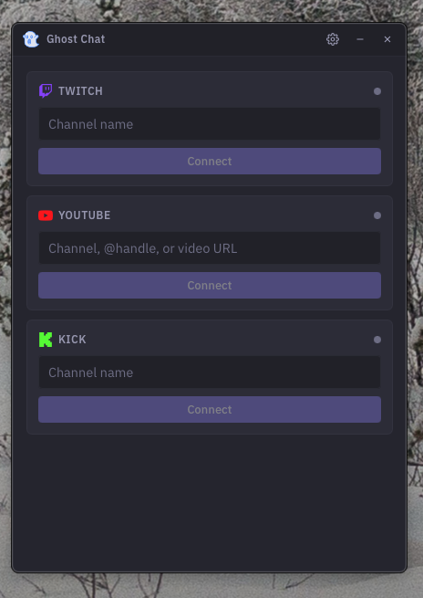
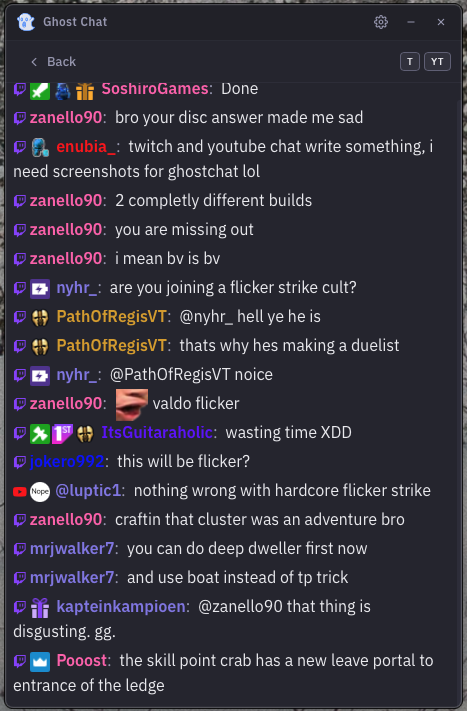
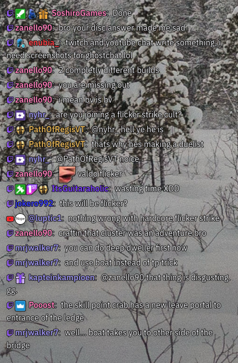
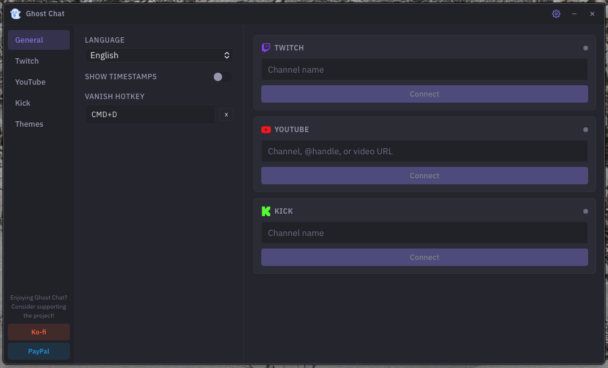
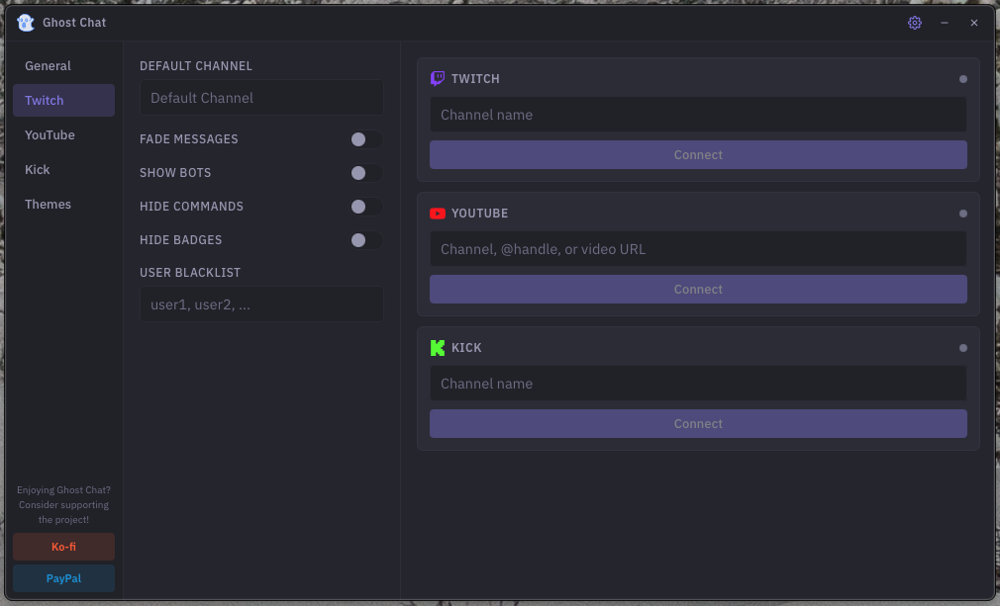
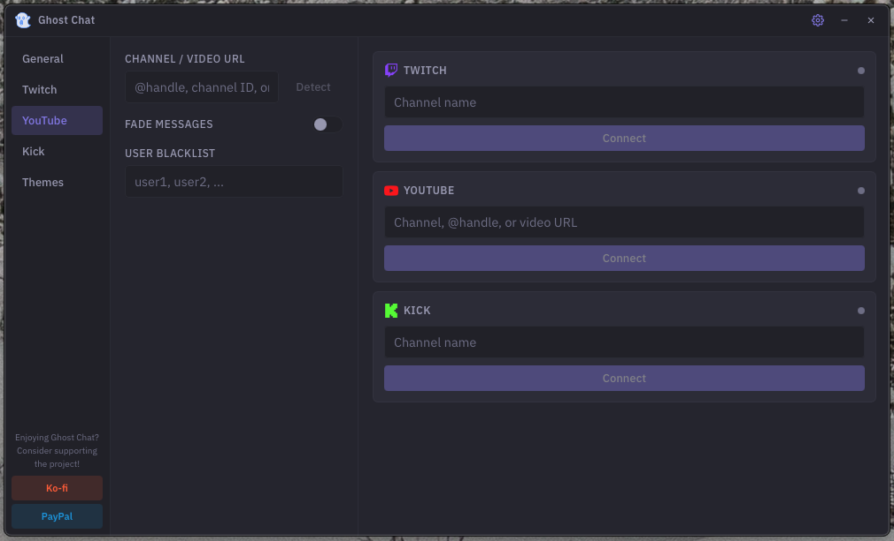
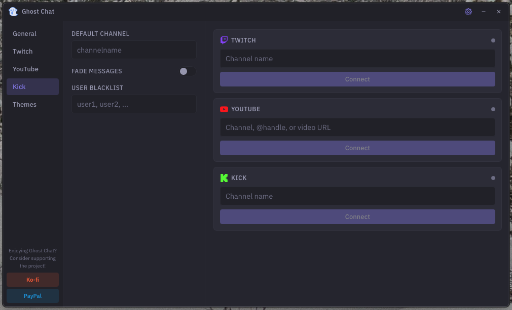
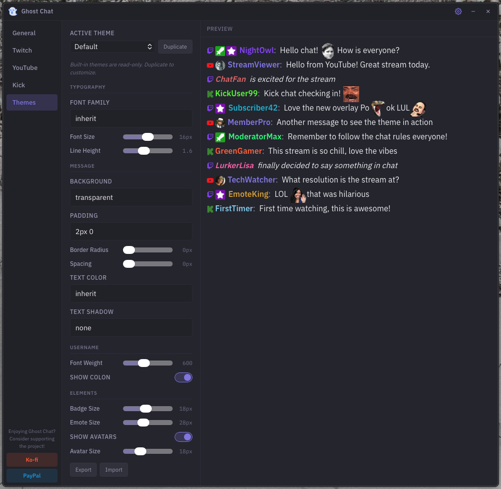

<p align="center">
  
</p>

<h1 align="center">Ghost Chat</h1>

<p align="center">
  Transparent chat overlay for streamers. Twitch, YouTube, and Kick in one window.
</p>

<p align="center">
  <a href="https://github.com/Enubia/ghost-chat/releases/latest">
    
  </a>
  <a href="https://github.com/Enubia/ghost-chat/issues?q=is%3Aissue+is%3Aopen+sort%3Aupdated-desc">
    
  </a>
</p>

<p align="center">
  <a href="https://www.paypal.com/donate/?hosted_button_id=RQFDVMBP397KG">
    
  </a>
  <a href="https://ko-fi.com/enubia">
    
  </a>
</p>

---

Ghost Chat is a lightweight desktop overlay that displays live chat from **Twitch**, **YouTube**, and **Kick** directly on your screen. No browser needed. Connect to one or all three platforms at once and see messages in a single, unified stream.

Built with Go and Wails v3 for native performance. Runs on macOS and Windows.

## Screenshots

<p align="center">
  
  
  
</p>

<details>
<summary>Settings</summary>
<p align="center">
  
  
</p>
<p align="center">
  
  
</p>
<p align="center">
  
</p>
</details>

## Features

- **Multi-platform chat** - Twitch IRC, YouTube Live Chat, and Kick in one overlay
- **Vanish mode** - Toggle transparency and click-through with a global hotkey
- **Custom themes** - Built-in themes (Default, Compact, Bubble) or create your own
- **Emote support** - Native Twitch, BTTV, FFZ, 7TV, YouTube custom emoji, Kick emotes
- **Badge rendering** - Twitch badges via GQL API, YouTube member/mod/owner badges
- **Super Chat & Membership** - YouTube Super Chat and membership events with styling
- **System tray** - Runs quietly in the tray with quick access to vanish, config, and quit
- **i18n** - English and German, more languages welcome
- **Fade messages** - Auto-fade with configurable timeout per platform
- **Filtering** - Hide bots, commands, or specific users per platform

## Downloads

| Platform | Download |
|----------|----------|
| macOS (Universal) | [ghost-chat-macos.zip](https://github.com/Enubia/ghost-chat/releases/latest) |
| Windows | [ghost-chat.exe](https://github.com/Enubia/ghost-chat/releases/latest) |

## Development

### Prerequisites

- Go 1.25+
- Node.js 20+
- pnpm
- Wails v3 CLI: `go install github.com/wailsapp/wails/v3/cmd/wails3@latest`
- macOS: Xcode Command Line Tools (`xcode-select --install`)
- Windows: WebView2 (included in Windows 10/11)

Verify: `wails3 doctor`

### Commands

```bash
wails3 dev                # dev mode with hot-reload
wails3 task build         # production binary
wails3 task package       # .app bundle (macOS) or .exe (Windows)
go test ./internal/...    # Go tests
cd frontend && pnpm fix   # lint + format
```

### Architecture

| Layer | Tech |
|-------|------|
| Backend | Go, Wails v3 bindings + events |
| Frontend | React, TypeScript, Zustand, CSS Modules |
| Chat clients | Twitch IRC (WebSocket), YouTube innertube (HTTP polling), Kick Pusher (WebSocket) |
| Build | Taskfile, Vite, GitHub Actions |

See [CLAUDE.md](CLAUDE.md) for the full project structure and conventions.

## Translations

Ghost Chat uses i18next. To add a language:

1. Copy `frontend/public/locales/en-US/translation.json`
2. Create a new folder with your locale code (e.g. `fr-FR`)
3. Translate the strings
4. Submit a PR

## Contributing

See [CONTRIBUTING.md](CONTRIBUTING.md) for guidelines.

<p align="center">
  <a href="https://github.com/enubia/ghost-chat/graphs/contributors">
    
  </a>
</p>

<p align="center">
  <a href="https://star-history.com/#enubia/ghost-chat&Date">
    <picture>
      <source media="(prefers-color-scheme: dark)" srcset="https://api.star-history.com/svg?repos=enubia/ghost-chat&type=Date&theme=dark" />
      <source media="(prefers-color-scheme: light)" srcset="https://api.star-history.com/svg?repos=enubia/ghost-chat&type=Date" />
      
    </picture>
  </a>
</p>
